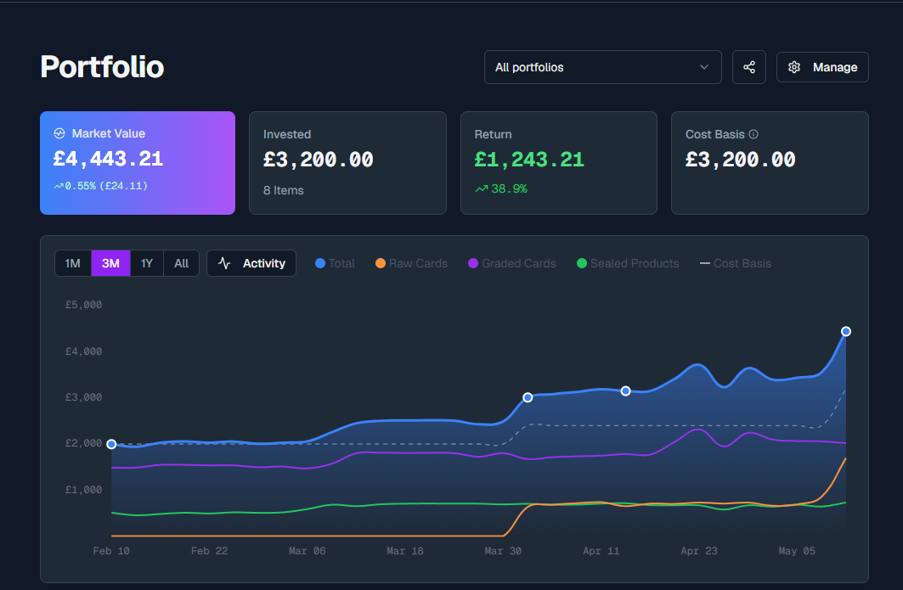

# Portfolio

Portfolio is where you will manage your personal portfolio [(Not Inventroy for that see)](https://www.mkdocs.org).

## Management

### Portfolio Selection

Allows you to choose between all portfolios, just a single portfolio or create a new portfolio.

### Share

Allows you to share your portfolio to others. 

`Enable Public Sharing` - Quickly enable or disable Public Sharing

`Display Name` - Name of the Portfolio on the shared page

`Portfolios to Share` - Select which of your Portfolios to share

`Privacy Level` - Select from 3 Options

First Header | Second Header
------------ | -------------
Public | Anyone can find and view your shared portfolios
Link Only | Only those with the direct link can view your shared portfolios
Password Protected | Anyone accessing your Portfolio will need the password to view it. Selection this option will then prompt for the password.

`Data Privacy Options` - Hide certain information from your shared portfolio

`Bio` - Add a short bio to be shared in your portfolio

`Weclome Message` - Add a Welcome Message for your portfolio visitors

### Manage

This allows you to bulk manage your portfolio including changing purchase dates, quantities, purchase price and add notes. 

You can also mass delete and move entries to other portfolios. 

## Values

### Market Value

Shows the entire Market Value of your portfolio at current prices

### Invested

The total amount you have invested into your portfolio

### Return

Your profit if you sold the entire portfolio at Market Value (Market Value - Invested Total)

### Cost Basis

Your total invested in your Portfolio minus the total value of your sales.

These represents the amount of money you still have at risk in your portfolio. This value is a minimum of £0.00

## Graph

Shows the value over time of your products, including changes based on sales/purchases as well as market prices

## Insights

### Raw Cards/Graded Cards/Sealed Product

Shows the breakdown of your Portfolio split by type.

Each type will show it's own figures, most valuable (Single Price), Largest Holding (Qty x Price) and Top Movers

### Allocation

Breakdowns for how your portfolio is allocated, and further broken down by set in the sub categories

### Price Distribtion 

Breakdown by Market Price range

### Performance Split

Split of how your portfolio is performing

(Strong / etc need to know how this calced)

## Items

### Advanced Analytics

Information needed

### Columns

Allows you to edit the coloumns shown in the table as well as the order

> List of columns here

### Manage

(Same as manage button at the top of the page)

This allows you to bulk manage your portfolio including changing purchase dates, quantities, purchase price and add notes. 

You can also mass delete and move entries to other portfolios. 

### Table

The table shows your entire portfolio broken down by Single Cards, Graded and Sealed. 

You can edit single cards here as well

`Set Custom Market Price` - Allows you to set your own market price. Useful for items which don't yet have a market or have old/low sales data

`Convert to Graded` - Convert the single card to a graded card, chosing your Grading Company, Grade and Grading Cost. This then moves the item to your Graded portfolio and adds the grading cost to the raw cost. 

`Change Condition` - Change the condition of a single card

`Mark as sold` - Allows you to mark a single card as sold with sell price and any notes. 